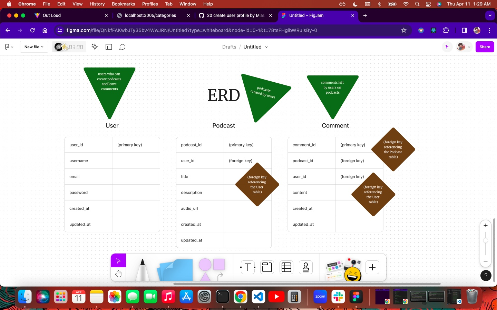
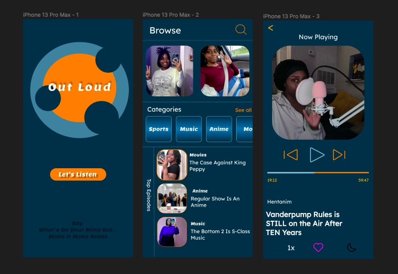
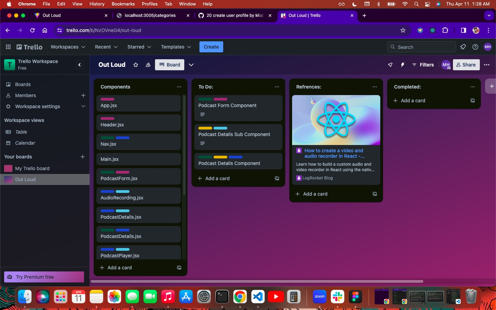
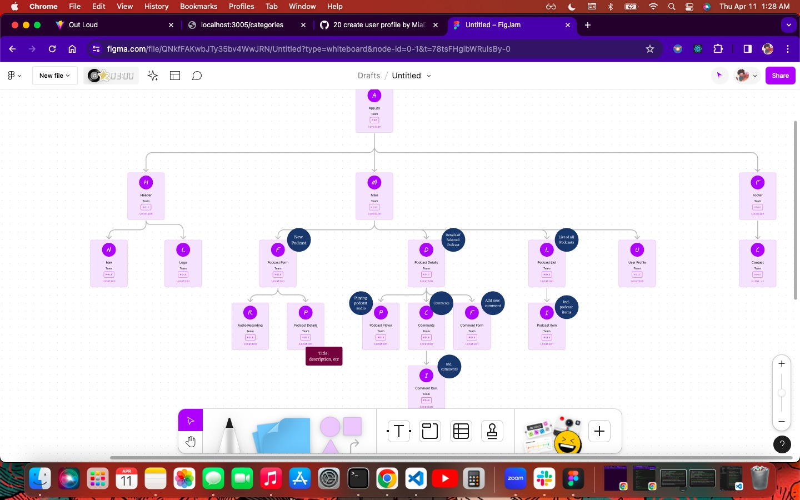

# OUT LOUD Podcast App

Welcome to OUT LOUD - Your go-to platform for discovering and sharing podcasts!

OUT LOUD is a podcast app that allows users to explore a wide range of podcasts on various topics, from entertainment and news to education and personal development. Whether you're a podcast creator or a listener, OUT LOUD provides a seamless experience for discovering, subscribing to, and enjoying your favorite podcasts.

## Wireframes

,

,

,

## Features

- **Browse Podcasts**: Explore a diverse collection of podcasts across different genres and categories.
- **Search Functionality**: Easily search for podcasts by title, genre, or keyword.
- **Audio Playback**: Stream or download podcast episodes for offline listening.
- **Social Features**: Like, comment, and share podcasts with friends and fellow listeners.

## Technologies Used

- **Frontend**:
  - React.js
  - HTML/CSS (styled with CSS or CSS frameworks like Bootstrap)

- **Backend**:
  - Node.js
  - Express.js
  - MongoDB (for database storage)

## Getting Started

To get started with OUT LOUD, follow these steps:

1. Clone the repository:
git clone <https://github.com/MiaDHayes/Out-Loud.git>

2. Install dependencies:
cd out-loud
npm install
    Morgan
    Nodemon
    Mongoose
    Body-parser
    React-Router-Dom
    React-Audio-Voice-Recorder
    MediaStream Recording API
    React Swiper

3. Start the development server:
npm run dev

4. Open [http://localhost:3000](http://localhost:3005) to view the app in your browser.

## Contributing

Contributions are welcome! If you'd like to contribute to OUT LOUD, please follow these guidelines:

1. Fork the repository and create your branch (`git checkout -b Out-Loud/OutLoudPodcast`).
2. Commit your changes (`git commit -m ''`).
3. Push to your branch (`git push origin feature/your-feature-name`).
4. Create a new pull request.

## Authors

- Mia Hayes GitHub (MiaDHayes)

## License

This project is licensed under the MIT License - see the [LICENSE.md](LICENSE.md) file for details.